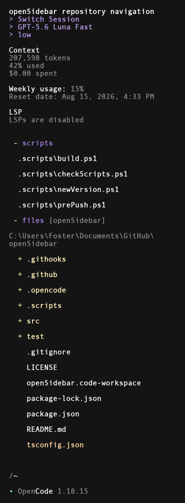

# openSidebar
Sidebar customization plugin for OpenCode.

*NOT COMPLETE* - tested only on Windows 10 LTSC IoT. Linux/Mac planned but not guaranteed to work. PRs/forks welcome.



## Features

### Header buttons


**`> Switch Session`** : clicking here invokes the 'switch session' command

**`> model`** : brings up the 'select model' menu. the label shows the current model

**`> weight`** : toggle through model weight / variant options

### Usage Meter

#### Supported subscriptions

- Codex
- OpenCode Go
- Cursor

#### Supported API services

- OpenRouter

### Files / Scripts

**`Scripts`**

Quickly run or reference project scripts. Left-click a script to run it, right-click to drop the path into chat. Runs go through the configured shell/language runner.


**`Files`**

Browse files right in the sidebar. Folders expand on left-click. Left-click a file, or right-click anything, to paste its quoted path into chat. Current directory tries to auto-set based on how the OpenCode session was started, but this can also be manually entered by clicking on the files header.

Built in search levereges Everything by Void Tools to quickly search files/folders in your active OpenCode session directory.


## Install

TUI plugins belong in **`tui.json`**, not `opencode.json` / `opencode.jsonc`.

**Recommended**

```powershell
opencode plugin -g open-sidebar
```

**Manual**

1. Open or create `%USERPROFILE%\.config\opencode\tui.json`
2. Add `"open-sidebar"` to the existing `"plugin"` array (merge; do not replace the whole file). Example fragment:

```json
"plugin": ["open-sidebar"]
```

3. Restart OpenCode.

After a release you can pin, for example `"open-sidebar@1.2.14"`.